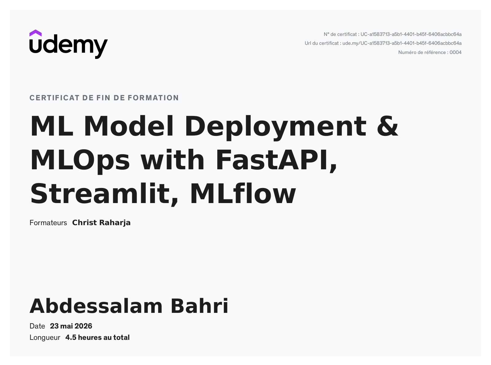

# MLOps Project

This repository contains an end-to-end example for deploying, tracking, and monitoring machine learning models. It demonstrates data preparation, model training, experiment tracking with MLflow, simple deployment options (FastAPI, Streamlit, Dash), and retraining orchestration.
Certificate

**Key Concepts**
- Model experimentation and tracking with MLflow
- Lightweight model serving with FastAPI
- Interactive apps with Streamlit and Dash
- Retraining and workflow automation examples (Airflow-ready script)

**Repository Layout**
- `datasets/` — example CSV datasets used for training and augmentation
- `Manage/` — training, retraining, augmentation, and MLflow tracking utilities
- `ML/` — model training scripts (examples using RandomForest / other estimators)
- `dep/` — small deployment/demo app scripts (FastAPI, Streamlit, Dash)
- `mlruns/` — MLflow experiment runs and saved model artifacts

**MLflow tracking & models**
- Experiment runs are stored under `Manage/mlruns/` (or top-level `mlruns/` depending on how MLflow is configured).
- Saved models and environment files appear in `Manage/mlruns/*/models/*/artifacts/`.

**Retraining / Automation**
- `Manage/retrain.py` and `Manage/retrainWithAirFlow.py` contain example retraining logic. They can be adapted to run on a schedule (Airflow, cron) and to register new model versions with MLflow.

**Datasets**
- `datasets/augmented_earthquake_data.csv` — augmented earthquake dataset used in examples
- `datasets/earthquake_alert_balanced_dataset.csv` — balanced dataset for classification experiments
- `datasets/flight_dataset.csv` — flight-related example dataset

